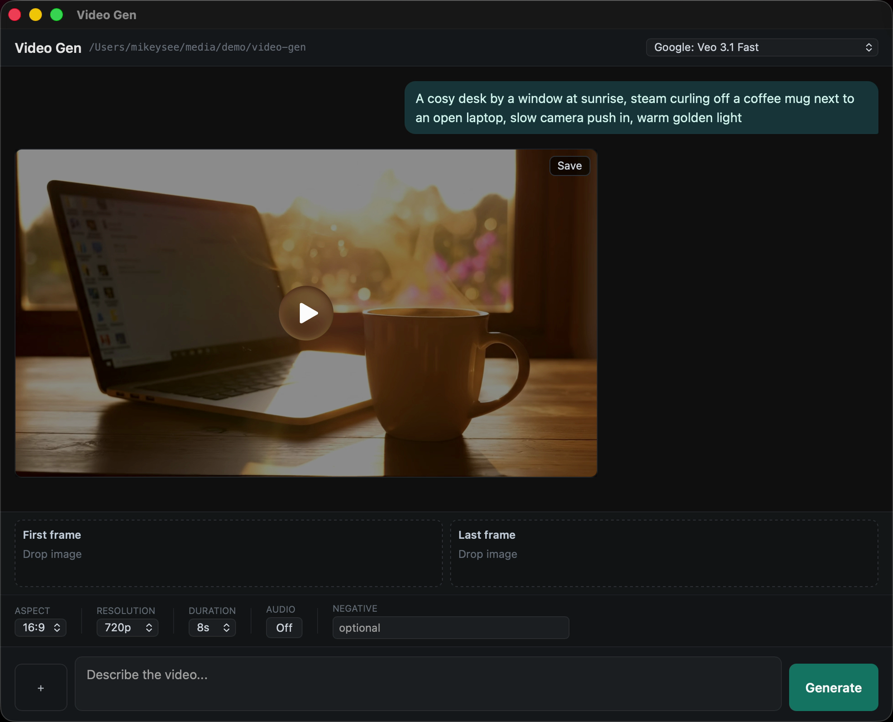

#  video-gen

Make short AI videos from a chat window, right from a folder

Windows · macOS

<!-- media: hero -->


[Watch it run (39 seconds, the wait is cut out)](docs/demo.mp4)
<!-- /media: hero -->

## What it is

This is like Image Gen but for video. It's a chat-style desktop app that talks to OpenRouter's video models, and it defaults to Veo 3.1 Fast.

It checks what the chosen model can actually do and only shows those options, so things like resolution, duration, audio, reference images and first or last frames come and go depending on the model. Videos take a while, so it waits for the job to finish and then downloads the MP4.

## Get it

Paste this into your AI coding agent (Claude Code, Codex, Cursor...):

> Clone https://github.com/mikecann/video-gen and make it my own. It's one of Mike
> Cann's personal tools, so read the README first, change anything specific to his
> setup to suit mine, then help me get it running.

### Or set it up by hand

You'll need Git, [Bun](https://bun.sh), and an OpenRouter API key with credit for video generation. The macOS launcher also uses Python 3 to resolve its symlink.

```sh
git clone https://github.com/mikecann/video-gen.git
cd video-gen
```

Copy `.env.example` to `.env` in this folder and fill in your key:

```env
OPENROUTER_API_KEY=your_key_here
```

On Windows, run these from PowerShell:

```powershell
Copy-Item .env.example .env
notepad .env
bun install --frozen-lockfile
bun run build:dev
powershell -NoProfile -ExecutionPolicy Bypass -File .\install.ps1
```

The installer checks dependencies and adds Video Gen under the shared Mike's Tools menu for folders and folder backgrounds. It uses your current Windows account and doesn't need administrator access. Use `-SkipDeps` if you've already checked the dependencies.

On macOS:

```sh
cp .env.example .env
# Edit .env and add your key before launching.
bash install.sh --with-bun-install
bun run build:dev
```

This symlinks `video-gen` into `~/.local/bin`. Add that folder to your shell's PATH if needed:

```sh
export PATH="$HOME/.local/bin:$PATH"
```

You can choose another destination with `bash install.sh /path/to/bin --with-bun-install`. Keep the clone where you installed it, or rerun the installer after moving it.

## Using it

On Windows, right-click a folder or the background inside one and choose:

```text
Mike's Tools > Video Gen
```

On Windows 11, you may need to choose **Show more options** first. You can also launch directly:

```powershell
wscript.exe ".\video-gen.vbs" "C:\path\to\output-folder"
```

On macOS, pass the folder where you want to save the videos:

```sh
video-gen "$HOME/Desktop"
```

Choose a model, enter a prompt and adjust the options it supports. You can add reference images or first and last frames when the model offers them. Wait for the job to finish, then preview the video in the window.

Generated videos are written to a temp folder first. Drag a video out of the window or click save to copy it into the folder video-gen was opened from.

## Notes

- Uses OpenRouter's async `/api/v1/videos` API.
- Defaults to `google/veo-3.1-fast`.
- Fetches model capabilities from `/api/v1/videos/models` and only offers valid resolution, duration, aspect, audio, and frame controls for the selected model.
- Supports prompt-only generation, reference images, and first/last frame control when the selected model exposes those capabilities.
- Video jobs are long-running; the app polls until OpenRouter marks the job complete, then downloads the MP4.

### Development and troubleshooting

```sh
bun install --frozen-lockfile
bun test
bun run typecheck
bun run build:dev
```

Rebuild after source changes. The launchers only build automatically when the `build/` folder is missing. On macOS, you can run `FOLDER_PATH="$HOME/Desktop" TOOL_DIR="$PWD" bun start` from the clone during development.

The build selects Bun explicitly to keep the existing runtime when using Electrobun 2. See the [Electrobun migration guide](https://framework.blackboard.sh/electrobun/guides/migrating-to-v2/) for that setting.

If the app reports a missing key, check `.env` in this clone and restart it. The launchers load that file before starting Bun. An `OPENROUTER_API_KEY` environment variable also works.

Logs are in `%TEMP%\video-gen\video-gen.log` on Windows and `/tmp/video-gen/video-gen.log` on macOS. Each session stores its generated MP4s in a separate folder alongside the log until you save them.

To uninstall on Windows:

```powershell
powershell -NoProfile -ExecutionPolicy Bypass -File .\uninstall.ps1
```

That removes video-gen's Explorer entries and generated icon. On macOS, remove the `video-gen` symlink from the destination you chose, normally `~/.local/bin/video-gen`.

## More tools

My other tools are at [mikerosoft.app](https://mikerosoft.app).

MIT licensed.
